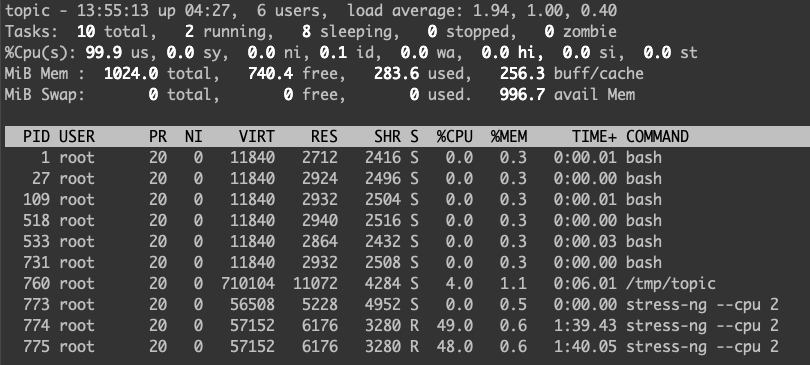

# topic

top in container.

Running the original `top` command in a container will not get information of the container, many metrics like uptime, users, load average, tasks, cpu, memory, are about the host in fact. 
`topic`(**top** **i**n **c**ontainer) will retrieve those metrics from container instead, and shows the status of the container, not the host.

Below shows a container of 2 cpu and 2 Gi running status when stress with `--cpu 2`.

## How to use

Download `topic` from GitHub [release page](https://github.com/silenceshell/topic/releases) to the container which you want to inspect, and add `x` attribute to the binary, then run the binary!

## How to build

Run `make build` for linux and amd64. `topic` only support on linux. If you want to run on other architectures, `GOARCH` is need to be set. 
